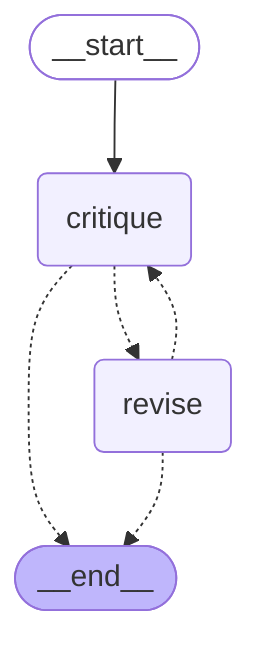

# LangGraph and LangSmith in MITOSIS — a walkthrough

A guide to one slice of this repo (2026-09-22): a **self-critique loop built on LangGraph** and **opt-in
LangSmith tracing**, written to be explained out loud. The normative records are
[ADR-103](DECISIONS.md) and [ADR-104](DECISIONS.md); this file is the plain-language version.

---

## The 30-second version

> MITOSIS runs LLM agents ("Cells") that propose business experiments under a kernel that enforces money
> and safety rules: every model call is reserved and billed before it happens, and every call is
> idempotent, so a crash never pays twice. I added a new reasoning pattern — draft, critique, revise,
> repeat until the critic says keep or a cap is hit — and used **LangGraph for the control flow only**.
> The graph decides *which step runs next*; the kernel still makes and bills every call. I deliberately
> didn't use LangGraph's checkpointer, because the kernel's idempotency keys already give crash-safe
> replay, and a second persistence layer would be a second source of truth. Then I added **LangSmith
> tracing** that is **off unless the operator opts in**, is forced off in sandboxed runs and the
> regression replay, and can never affect billing even if the tracing library breaks. 28 new tests,
> plus 16 mutation checks proving each guard actually catches the bug it exists for.

---

## What the loop does

After a Cell's first draft proposal validates:

1. **critique** — one model call: *"is this ready?"* It must reply with strict JSON:
   `{"verdict": "keep"}` or `{"verdict": "revise", "issues": ["…"]}`.
2. On **revise**, **revise** — one model call shown the issues, replying with a new proposal.
3. Back to **critique**, at most `MAX_CRITIQUE_REVISIONS = 2` times.

So a wake costs 2 to 5 calls. The last proposal that validated gets recorded. If any step fails —
invalid JSON, provider down, Cell can't afford it — the wake keeps the best proposal it already has.

The graph, drawn by LangGraph from the compiled object (`workflow_graph.mermaid()`), so it can't drift
from the code:



Dashed edges are conditional: `critique → END` on *keep* or an invalid verdict; `revise → END` on an
invalid revision or when the cap is reached.

---

## Where LangGraph sits — and where it doesn't

```
deliberation.deliberate()            ← one wake; opens the root trace span
  └─ first draft: gateway.call_model  ← reserve money → call provider → settle
  └─ _self_critique_loop()            ← builds two closures over _workflow_call
       └─ workflow_graph.run_critique_loop()   ← LangGraph: WHICH step next
            ├─ critique node → closure → _workflow_call → gateway.call_model
            └─ revise node   → closure → _workflow_call → gateway.call_model
```

- `src/mitosis/workflow_graph.py` is the only file that imports LangGraph. **It imports nothing from the
  kernel** — a test parses its source and fails if it ever does. It gets two plain functions and returns
  a result. It has no way to reach a database, a provider, or money.
- Every step is still `_workflow_call`, which goes through the gateway with its own idempotency key:
  `deliberation:{wake_key}:workflow:critique:0`, `…:revise:0`, `…:critique:1`, …

**Why this split matters:** the tempting design is a LangChain chat-model node that calls the LLM
directly. That skips the gateway, so it skips the reservation, metering and spend caps. It's the most
serious safety violation this codebase can have, dressed up in a friendlier API.

---

## The decisions, and what each one turned down

The interesting part of this slice is what it *didn't* do.

| Decision | Turned down | Why |
|---|---|---|
| LangGraph owns control flow only | LangGraph/LangChain making the LLM calls | Calls would bypass the gateway's reserve-before-execute rule (Charter C4) |
| **No checkpointer** | LangGraph's durable state persistence | The gateway's idempotency keys already make a crashed wake replay the same path without paying again (tested). A checkpointer would be a second source of truth, and the spec defers durable workflow engines (§17.5) |
| Keep/revise verdict with named issues | A numeric "confidence" stop condition | A self-reported probability sits next to the scored forecasts and invites misuse; the revise step needs the issues anyway |
| Hard cap (2 revisions) plus LangGraph `recursion_limit` | An unbounded "until good" loop | A critic that always says revise must cost a known amount. The recursion limit is a second bound in case the wiring is ever wrong |
| Optional dependency (`mitosis[langgraph]`) | Making it required | ~20 transitive packages; the spec treats third-party code as untrusted (§19.3). Without it, the wake keeps the draft and says why |
| Not bred by the evolution simulator | Letting evolution drift into it | The simulator's fake model only writes proposals, so the loop would just be one extra billed call every time. Selection would punish a cost the simulator made up |
| LangGraph over 15 hand-written lines | Hand-rolling the loop | Defensible either way for one loop. Chosen because the next patterns (a critic on a different model, role decomposition) are graphs too, and a compiled graph draws its own diagram |

---

## Tracing with LangSmith

**What you see when it's on:** one trace per wake, in project `my-first-agent`:

```
cell_wake                     (chain: cell, wake reason, outcome)
├─ model_call                 (llm: prompt, reply, token usage, model_call_id)
└─ self_critique_loop         (LangGraph, automatic)
   ├─ critique → model_call
   ├─ revise   → model_call
   └─ critique → model_call
```

**How to turn it on** (your own key, in your own shell):

```bash
export LANGSMITH_TRACING=true
export LANGSMITH_API_KEY=<your key>
export LANGSMITH_PROJECT=my-first-agent   # optional; this is the default
```

**The design rules:**

- **Off unless opted in, and off is enforced.** LangSmith and LangChain each read their own environment
  variables. A variable left over from another project would otherwise start sending this project's
  prompts. Every span explicitly sets `tracing_context(enabled=…)` from this repo's own decision, which
  overrides the libraries' switches. Tested.
- **Forced off in two places even when opted in:** sandboxed simulator runs, which seal the process
  against network access, and the golden-run regression replay, which must never touch a network.
- **A trace is a view, never the record.** The database is the record. Nothing reads traces back, so a
  lost upload changes nothing. Each LLM span carries `model_call_id` so you can join a trace to the
  database row.
- **Tracing can't break billing.** The gateway opens its span *after* committing the money reservation.
  If the tracing library threw there, the reservation would be stranded. So tracing swallows its own
  errors, while errors from the traced code pass through untouched. There's a test that breaks the
  tracing library on purpose and checks the call still completes and bills once.
- **One integration point for every provider.** The span lives in `gateway.call_model`, which every call
  already passes through, so mock, Ollama and Anthropic are all covered by one span.

---

## How it's verified

- **28 new tests.** The loop's properties: bound, floor, replay, strict verdicts, fallback without the
  package, no kernel imports. Tracing: the opt-in rule, seal, golden run, nesting, fault tolerance, and
  "tracing on records exactly what tracing off records". The end-to-end tracing tests point LangSmith at
  a tiny HTTP server on `127.0.0.1` and decode what it uploads, so no data leaves the machine.
- **16 teeth-checks (mutation testing).** For every guard, `scripts/teeth_check.py` reintroduces the bug
  in an isolated copy of the repo and requires the named test to fail *with the expected assertion
  message*, not just fail. Example: delete the revision cap and the bound test must fail. It did, and the
  failure came from LangGraph's recursion limit, which shows the backstop works too. All 16 caught.
- **The whole suite still passes** (1618 tests), the golden-run replay hash is unchanged, lint and docs
  checks are clean.
- **End-to-end CLI run** with tracing to a local collector: three wakes produced three traces, uploaded
  before the process exited.

**Honest gaps:** the live run against a local model (`qwen2.5` via Ollama) didn't happen, because
Ollama's GPU backend was failing on the day. And nobody has yet measured whether critique-and-revise
actually produces *better* proposals. That needs an evaluation harness with a judge on a different model,
and it's logged as the next step.

---

## Likely interview questions

**"Why LangGraph instead of just a while loop?"**
For this one loop, a while loop is honestly fine. I said so in the ADR. I chose LangGraph because the
next patterns on the roadmap are graphs (a critic on a different model, role decomposition), because
conditional edges make the stop conditions explicit in one place instead of scattered through ifs, and
because the compiled graph renders its own diagram, so the docs can't drift. What I avoided was letting
the framework take over things the kernel already does better.

**"Why no checkpointer? Isn't persistence the main reason to use LangGraph?"**
It's a main reason. But this system already has crash safety one level lower: every model call is keyed
on the wake and step, so replaying a crashed wake returns the same stored replies, and the graph walks the
same path for free. I wrote a test that crashes a wake mid-loop and checks the retry makes zero new calls
and records the same proposal. A checkpointer would give a second answer to "where did this run get to",
and two sources of truth can disagree.

**"How do you stop an agent loop from running away on cost?"**
Three layers. A designed cap of 2 revisions, so at most 5 calls. LangGraph's `recursion_limit`, set just
above that, as a backstop against wiring bugs. And every call still goes through the gateway, which
reserves money first and refuses when the agent's budget or the colony's spend cap is hit. Mutation
testing confirmed that removing the first layer gets caught by the second.

**"What if the model returns garbage for the critique?"**
The verdict parser is strict: only `verdict` and `issues`, a revise must name at least one issue, capped
count and length. Invalid means the step is recorded as "did not validate" and the wake keeps its current
best proposal. It never gets worse than a single pass.

**"How did you handle observability and data privacy?"**
Tracing sends prompts to a third party, and the spec says network is off by default. So it's opt-in with
two variables, enforced off even if other LangChain variables are set, and forced off in sandboxed and
regression runs. Traces carry the database row id so they can be joined to the record, but nothing ever
reads them back. Redacting fields before upload is the next step I logged.

**"What would you do next?"**
Run the live smoke. Then build an evaluation: export traces to a LangSmith dataset of draft/final pairs,
score them with a judge on a different model family, and find out whether the loop is worth its extra
calls. That's what decides whether evolution should favour it. I'd keep those scores out of the agents'
fitness, because an agent optimising for a judge's score is its own failure mode.

---

## Try it

```bash
.venv/bin/pip install -e '.[dev]'
```

```bash
.venv/bin/python -m pytest -q tests/test_workflow_structure.py tests/test_tracing.py
```

```bash
.venv/bin/python -c "from mitosis import workflow_graph; print(workflow_graph.mermaid())"
```

A founder Cell that uses the loop:

```bash
.venv/bin/mitosis --db /tmp/colony.db create-cell --type explorer --budget 5.00 --book USD_SIM --genome '{"market": "small accounting firms", "problem": "month-end close is manual", "workflow": {"structure": "self_critique_loop"}}'
```

## File map

| File | What it holds |
|---|---|
| `src/mitosis/workflow_graph.py` | The LangGraph graph: nodes, conditional edges, reducer, bounds |
| `src/mitosis/deliberation.py` | `_self_critique_loop` runner, critique prompt, `_parse_verdict`, root trace span |
| `src/mitosis/tracing.py` | The opt-in decision, `span()`, `suppressed()` |
| `src/mitosis/gateway.py` | The `llm` span around the provider call |
| `src/mitosis/simulation/mutation.py` | `_NOT_BRED_STRUCTURES` |
| `tests/test_workflow_structure.py` | Loop tests (bottom section) |
| `tests/test_tracing.py` | Tracing tests with a local collector |
| `docs/DECISIONS.md` | ADR-103, ADR-104 |
